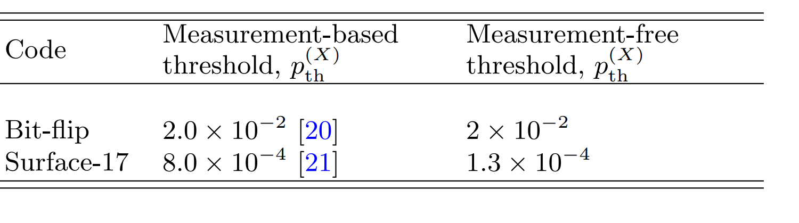

# Measurement Free Error Correction

Traditional Quantum Error Correction requires measurment and feed back into
quantum circuit. Due to physical law's limitation, they are doomed to be costly
timewise. Decoherence could well happen. We present a time-ordered development
of measurement free error correction.

## Summary 
The concept and proof for fault-tolerant measurement free schemes have all been
done in the 90s. The rest of the work are either experimental proof or pushing
the threshold up.

## First of Measurement Free Schemes

The first paper that mentions measurement free quantum error correction was due
to Aharonov et. al [^4]. Not only did they improve Shor's previous result on
threshold of quantum error correction from being polylogarithmic to computation
size to constant, but also they shown in Section 4 in the paper that
no-measurement was necessary for quantum error correction. More concretely, they
constructed a universal set of gates without using measurement. In the paper,
they used CSS code and assumed noise is local and un-correlated in time, i.e
Markovian. The threshold they obtain is $\eta_c \approx 10^{-6}$.

In a following paper [^5], measurement free quantum error correction was used to
circumvent the problem of single molecule measurement being impossible on NMR
machine. They included concrete example of how to implement these mfqc. No extra
theoretical contribution was made.

!!! note "Entanglement Understanding"
    In a different paper by Peres[^6], he linked the measurement of error
    syndrom being un-necessary with entanglement and teleportation. However, no
    concrete construction or threshold analysis was given.
    
## Later Developments

Much later, [^2] mentions measurement free scheme was. But he did not give any
reference to paper. In this paper he was considering the effect of slow and fast
measurement on error correction threshold. They reasoned that slow measurement
was ok because "measurements can take place concurrently within the many levels
of concatenation required to achieve fault tolerance." [^12]. Hence making
measurement-free scheme only desirable in intermediate scale.

The next development in measurement free scheme was in [^3]. It used Bacon-Shor
code for example. They shown that the measurement free scheme was "only about an
order of magnitude worse than conventional schemes" [^12].

[^9] provides basic in measurement free quantum error correction. 

## Experimental Realizations

[^1] is an experimental paper that realizes measurement-free quantum error
correction on trapped ions. Provided shit reference, inaccurate.

[^7] improved threshold for mfeqc "improved these results by using redundant
syndrome extractions and reported thresholds for three qubit bitflip (BF),
Bacon-Shor, and Steane codes that are comparable to measurement-based values".[^12]

[^8] provides usage of mfqec in qudit spin. 

[^10] discussed Fault tolerant classical computation. People that provides
garbade citation needs to be punished.

[^12] benchmarks measurement free quantum error correction on quantum dots
systems. Threshold was shown as below.

[^11] implementation in bosonic code.

[^1]: [Schindler2011Experimental](@cite)
[^2]: [divincenzo2007effective](@cite)
[^3]: [paz2010fault](@cite)
[^4]: [aharonov1997fault](@cite)
[^5]: [Boykin2004Fault](@cite)
[^6]: [peres1998quantum](@cite)
[^7]: [crow2016improved](@cite)
[^8]: [Omanakuttan2024Fault](@cite)
[^9]: [Premakumar2019Decoherence](@cite)
[^10]: [cruikshank2017high](@cite)
[^11]: [gertler2021protecting](@cite)
[^12]: [ercan2018measurement](@cite)

